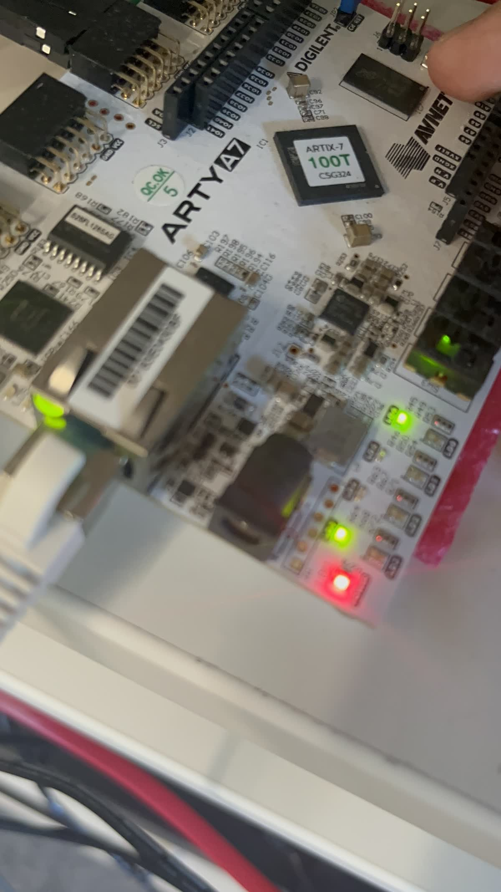
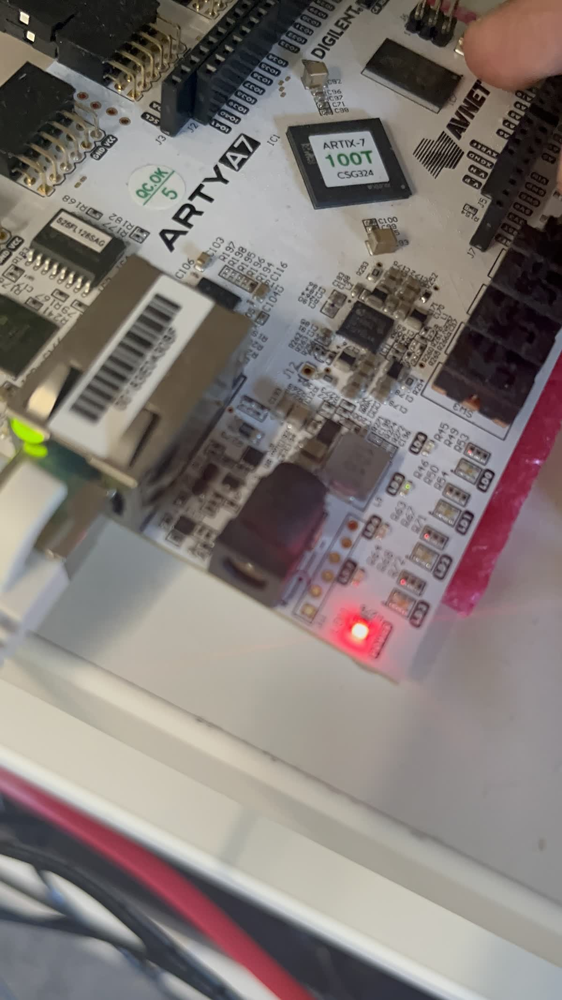
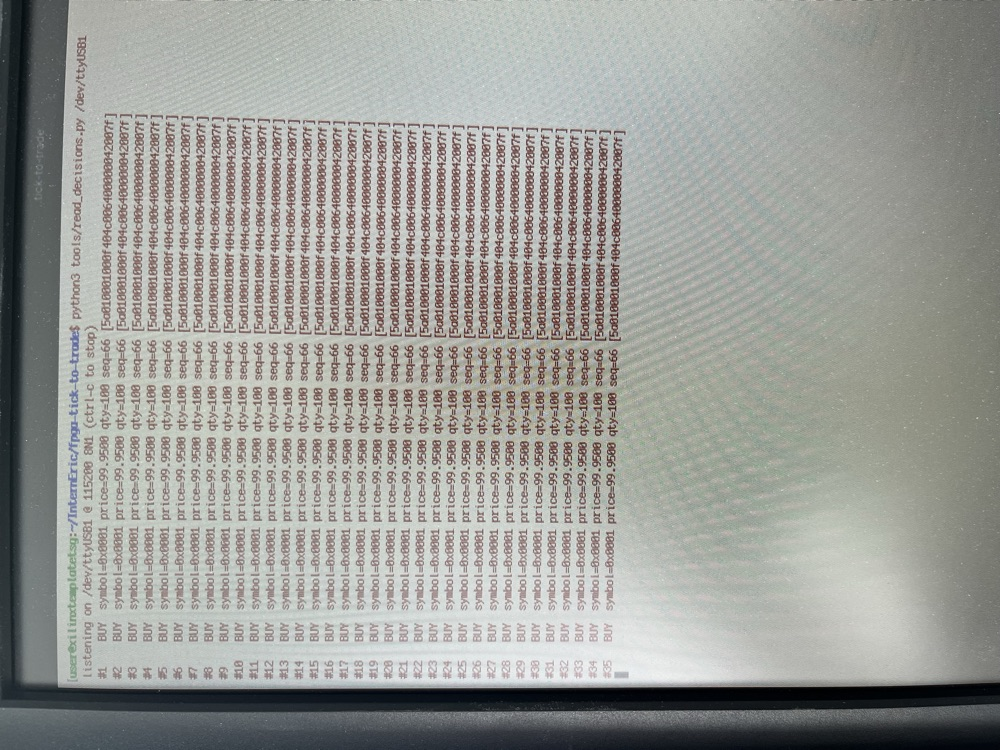

# fpga-tick-to-trade

**A deterministic, formally verified tick-to-trade engine in FPGA fabric.**
Ethernet/IPv4/UDP and market-data frames are parsed as the bytes arrive on
the wire; a fixed-latency trigger turns qualifying quotes into trade decision
records — with no CPU, no cache, and no interrupt anywhere in the critical
path.

[](../../actions/workflows/ci.yml)
[](LICENSE)

## What it does

```
wire ──▶ eth ──▶ ipv4 ──▶ udp ──▶ market-data ──▶ fixed-latency ──▶ TTD-16 records
        parse    parse    parse   parse (MDM-16)   trade trigger      (DMA / UART)
                     one byte per cycle, all stages in lockstep
```

- **Parses in flight.** Each protocol layer is validated as its bytes stream
  past — MAC filter, EtherType, IPv4 header checksum (verified in hardware),
  fragment/option rejection, UDP port and length, market-data structure.
  There is no packet buffer anywhere: by the time the last payload byte
  arrives, every check has already resolved.
- **Decides at a fixed offset.** For every frame — accept, reject, or
  truncated runt — the verdict emerges **exactly 5 clock cycles after the
  last payload byte** (50 ns at the demo clock). Not "typically": the
  fixed-latency property is proven for all inputs by k-induction, and
  measured per-frame in simulation.
- **Fails closed, provably.** SymbiYosys proves that a trade can *never*
  fire unless every validation flag was simultaneously green and the frame
  was complete — not "no counterexample found in N cases," but "a
  counterexample cannot exist." A risk cap on order quantity is proven the
  same way.
- **Emits self-checking decision records.** Fired decisions leave as 16-byte
  TTD-16 records (symbol, price, capped quantity, echoed sequence number,
  XOR integrity byte) on an AXI-Stream — the hardware/software boundary a
  DMA engine or the demo UART drains. The echoed `seq` lets the host measure
  true end-to-end tick-to-trade latency.

## Verification

| layer | what | where |
|---|---|---|
| Directed benches | per-module cocotb tests incl. byte-order traps, boundary prices, runts, back-to-back frames, bursty `tvalid` gaps, consumer stalls, queue overflow | `tb/test_*.py` |
| Golden-model fuzz | 300 adversarial frames vs. an independent Python reimplementation; stimulus encoded by scapy (a third implementation); asserts exactly one verdict per frame and byte-exact records | `tb/test_fuzz.py` |
| Formal (k-induction) | AXI-Stream contract + single-slot invariant (skid buffer); fixed latency, no-fire-without-validation, quantity cap (trigger); occupancy invariants (FIFO) | `formal/*.sby` |
| CI | all of the above on every push, plus full-repo elaboration lint | `.github/workflows/ci.yml` |

```bash
# reproduce everything locally
python3 -m venv .venv && source .venv/bin/activate
pip install -r tb/requirements.txt
make -C tb regress                # all benches + fuzz (Icarus Verilog)
sby -f formal/axis_skid.sby       # proofs (Yosys + SymbiYosys + z3)
sby -f formal/trade_trigger.sby
sby -f formal/sync_fifo.sby
```

## Running it on hardware (Arty A7)

The board demo streams a canned quote frame from on-chip ROM into the engine
~3× per second. Switches corrupt the frame live; LEDs show the outcome; the
actual TTD-16 records arrive on the USB-UART.

```bash
vivado -mode batch -source synth/build_bitstream.tcl   # writes build/fpga_top.bit
vivado -mode batch -source synth/program.tcl           # program over JTAG, then:
pip install pyserial
python3 tools/read_decisions.py /dev/tty.usbserial-XXXX
```

Full flow details and the on-board verification sequence:
[docs/HARDWARE.md](docs/HARDWARE.md).

| control | effect |
|---|---|
| `sw[0]` | corrupt the quote price → threshold not crossed → no fire |
| `sw[1]` | corrupt the IP checksum → header reject → no fire |
| `sw[2]` | corrupt the UDP port → port reject → no fire |
| `btn[0]` | reset |

| LED | meaning |
|---|---|
| `led[0]` | a decision fired (stretched pulse) |
| `led[1]` | per-frame verdict heartbeat (fires for rejects too — fixed latency is unconditional) |
| `led[2]` | sticky: decision queue overflowed |
| `led[3]` | ~1.5 Hz liveness heartbeat |

With all switches down, `tools/read_decisions.py` prints one BUY record per
frame period:

```
#1    BUY  symbol=0x0001 price=99.9500 qty=100 seq=66 [5a010001000f404c006400000042007f]
```

(qty is 100, not the quote's 250 — the proven `MAX_QTY` risk cap in action.)

## Results

**Simulation & formal (reproducible from this repo, re-established by CI on
every push):** all benches green, 300/300 fuzz cases in agreement with the
golden model, all three proofs pass by k-induction.

**Core characterization** (`tick2trade_top`, out-of-context synthesis
against a 4 ns probe clock — reports committed at `build/char_*.rpt`):

| metric | value |
|---|---|
| Fmax (post-synth estimate) | ~202 MHz (WNS −0.947 ns at 4 ns) |
| LUTs | 304 (242 as logic) |
| Flip-flops | 477 |
| Block RAM / DSP | 0 / 0 |
| Critical path | MAC-match flag → trigger delay pipes (4 LUT levels, 76% routing) |

**Board demo (Arty A7-100T, xc7a100tcsg324-1, `fpga_top`):**

| metric | value |
|---|---|
| Demo clock | 100 MHz |
| WNS (setup) | +4.205 ns → timing met |
| Implied Fmax (demo wrapper) | ~172 MHz |
| Flip-flops | 604 |
| LUTs | ~437 |
| Critical path | ROM index → corruption mux → eth broadcast match (4 logic levels) |
| Decision latency | 5 cycles / 50 ns (proven, measured) |

In both runs the checksum fold is nowhere near the critical path — the
demo's limiter is ROM furniture and the core's is flag routing into the
trigger — confirming the design rationale's prediction (§3).

**Board verification** — a corruption switch toggled live: trades firing
(`led[0]` + `led[1]`), corruption engaged (`led[0]` stops, heartbeat
continues — fixed latency is unconditional), then recovery:

<p align="center">
  
</p>

<p align="center">
  
  
</p>

**Live TTD-16 records** on the USB-UART — every record carries `qty=100`
against the quote's 250, the formally proven risk cap observed on silicon:

<p align="center">
  
</p>

## Repository map

```
rtl/      the engine (SystemVerilog-2012, synthesizable, Icarus+Vivado clean)
tb/       cocotb benches + golden model + fuzz  (make -C tb regress)
formal/   SymbiYosys proofs                      (sby -f formal/<x>.sby)
synth/    Vivado flows + Arty A7 constraints
tools/    demo-frame generator, UART record reader
docs/     ARCHITECTURE.md, PROTOCOL.md (wire formats), HARDWARE.md (board flow)
```

## License

[MIT](LICENSE)
